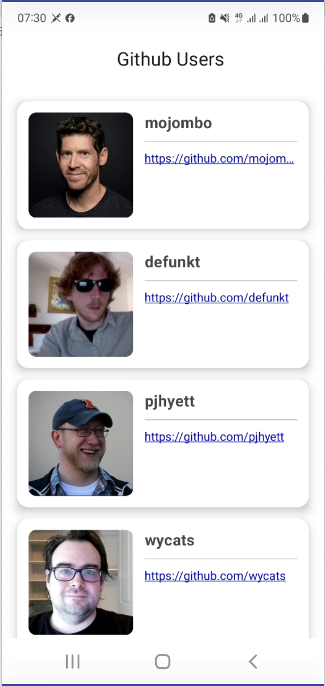
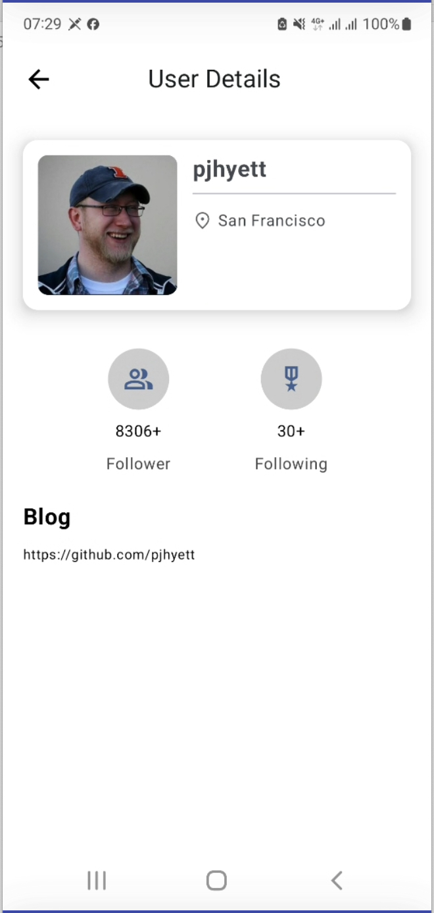
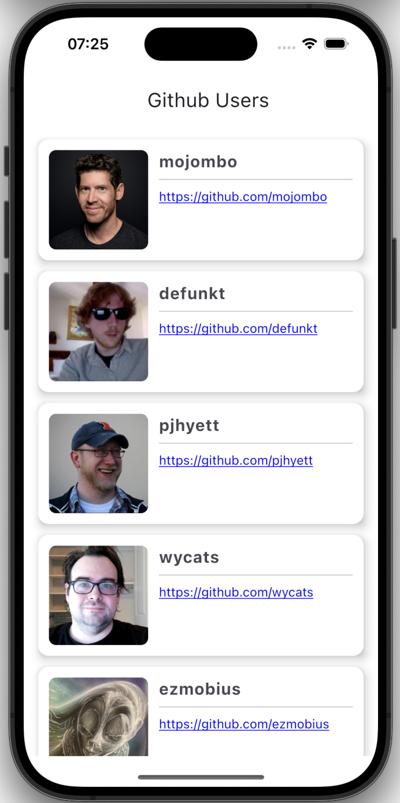
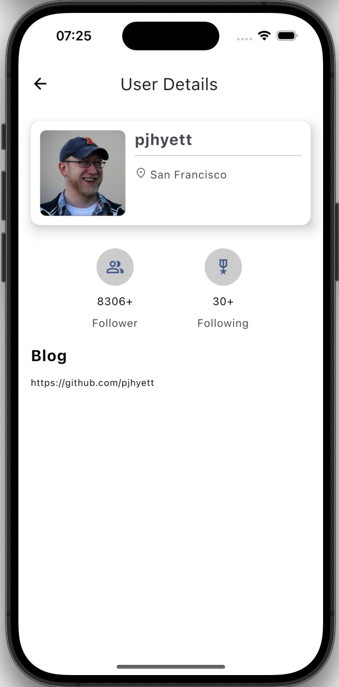

[iOS is done by Kotlin Multiple Platform](https://github.com/viethoa/kmp-githubadmin)

  
  
  
  

Tech stack
-----
- Architecture: MVVM
- Libraries: JetpackCompose, Ktor, Room, Koin
- Unit Test: Junit, Mockk
- Instrumentation Test: Junit, Espresso

Module graph
-----

